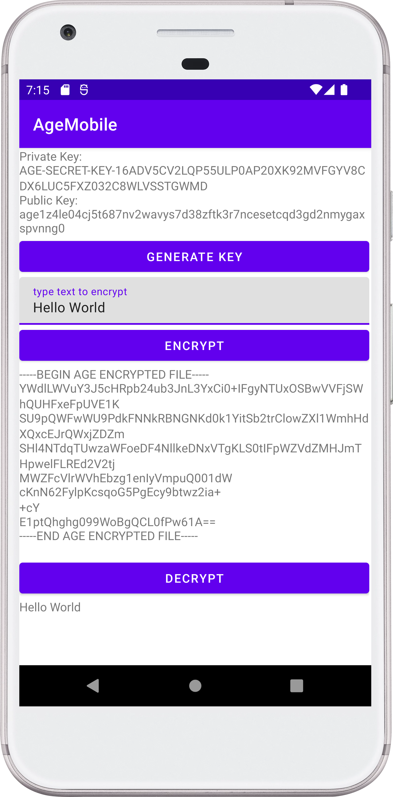

# agemobile

Gomobile bind is limited by types and while it allows you to generate identity, you cannot encrypt/decrypt.

This package wraps age library into usable mobile library.



## Install

### Android

1. Get `age.aar` (You can get `age.aar` from [release page](https://github.com/MarinX/agemobile/releases) or clone the repo and execute `make build-android` to build .aar yourself)
2. Create `libs` folder in your app project android app and copy `age.aar`
3. Include dependency for Android in `build.gradle`

```gradle
dependencies {
    ...
    // AgeMobile aar from Go
    implementation fileTree(include: ['age.aar'], dir: 'libs')
}
```

### iOS

No documentation, PR's welcome

## Usage

### Android

There is an example project in [\_examples/android](./_examples/android/AgeMobile) folder

#### Generate key

```java
import agemobile.Agemobile;

try {
    age.X25519Identity identity = Agemobile.generateX25519Identity();
    String privateKey = identity.string();
    String publicKey = identity.recipient().string();
} catch (Exception e) {
    e.printStackTrace();
}
```

#### Decrypt

```java
import agemobile.Agemobile;

// decrypt text
try {
    String decryptedText = Agemobile.decrypt("age-key/s","with or without armor encrypted text");
} catch (Exception e) {
    e.printStackTrace();
}

// decrypt file
try {
    Agemobile.decrypt("age-key/s","input file to decrypt", "output path where to write decrypted file");
} catch (Exception e) {
    e.printStackTrace();
}
```

#### Encrypt

```java
import agemobile.Agemobile;

// encrypt text
try {
    Agemobile.encrypt("age-keys","text to encrypt");
} catch (Exception e) {
    e.printStackTrace();
}

// encrypt file
try {
    Agemobile.encryptFile("age-keys","input file to encrypt", "output path where to write encrypted file");
} catch (Exception e) {
    e.printStackTrace();
}
```

### iOS

No examples, yet! PR's welcome.

## Contributing

PR's are welcome. Please read [CONTRIBUTING.md](https://github.com/MarinX/agemobile/blob/master/CONTRIBUTING.md) for more info

## License

MIT
